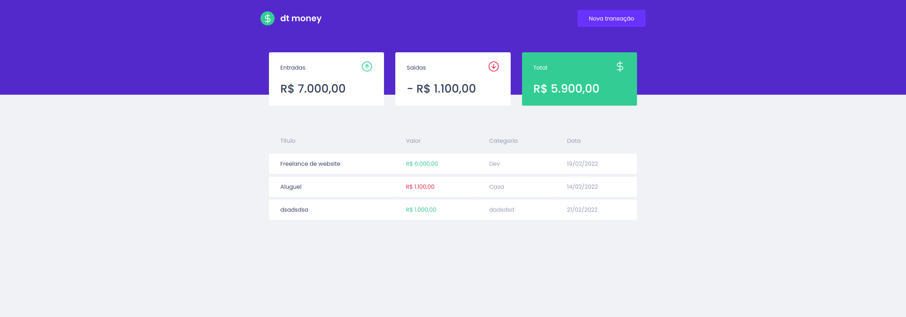
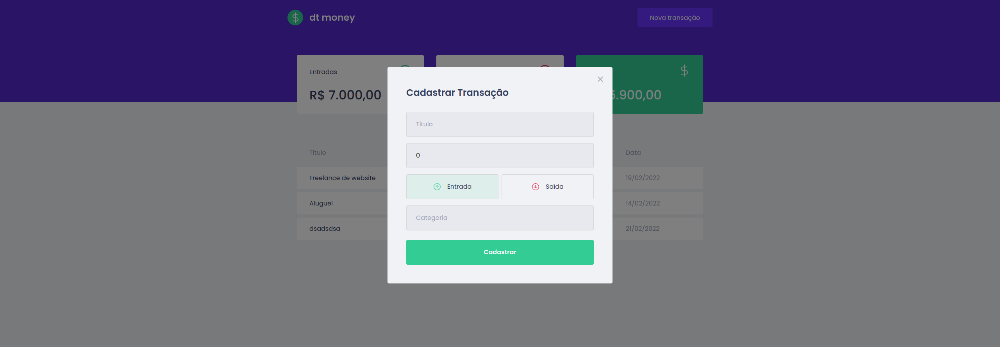

# MC Money

Aplicação desenvolvida no Chapter II. Criando uma aplicação de controle de gastos pessoal em ReactJS da Jornada Ignite Rocketseat, instrutor Diego Fernandes.

#### dependencies:

- axios
- miragejs
- polishe
- react
- react-dom
- react-modal
- react-scrip
- styled-component
- web-vitals

#### devDependencies:

- @testing-library/jest-dom
- @testing-library/react
- @testing-library/user-event
- @types/jest
- @types/node:
- @types/react:
- @types/react-dom
- @types/react-modal
- @types/styled-components
- typescrips

---

## Screenshot

 

---

💜 Ignite Trilha ReactJS 2022
